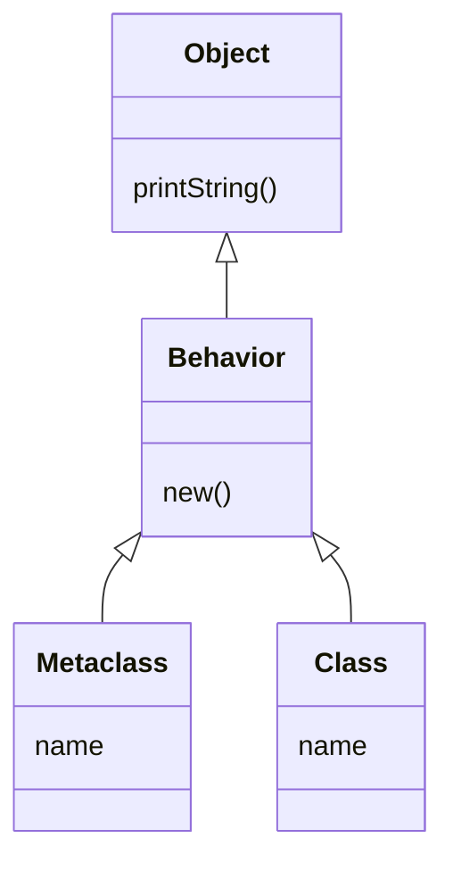

## Principio de OO
Objecto con **comportamiento especial** necesita **clase especial**

## Sub-clasificación

Objeto se **comporta según** lo definido por la **jerarquía** de su clase. (para ver si es una buena subclase preguntarse: 'Se comporta como: « padre »?'

![[metamodelo.png]]


#TODO cambiarlo!! Es erróneo
```
classDiagram

    
    Object <|.. Class
    Object <|.. Metaclass
    Object <|.. MetaclassClass

    class Object {
        printString()
        new()
    }

    class Date {
        year
        today()
    }

    class Class {
        name
        new()
    }

    class Metaclass {
        name
        new()
    }

    class MetaclassClass {
        "metaclass of Metaclass"
    }

    %% Relaciones metaclase
    Class <|-- DateClass
    DateClass <|-- Date
    class DateClass {
        name = "Date class"
        new()
    }

    Class <|-- ObjectClass
    class ObjectClass {
        name = "Object class"
    }

    Metaclass <|-- Class
    MetaclassClass <|-- Metaclass

```

## Principio 1

Todo es un Objeto

### Conclusión

Toda clase es un objecto

## Meta-modelo



### Ideas y a tener en cuenta
+ Las clases separan según lo que hacen. Si una tiene un comportamiento especial, separarla.
+ Las clases tienen una clase: **metaclass** que sabe responder *name*
+ Como tanto la **metaclass** como **class** tienen el mismo comportamiento, falta una abstracción: **behaviour**. Todas las clases se comportan como el **behaviour**, que a su vez es un objeto, pues todo es un objeto.
+ La meta-clase de *metaclass* es *meta-class class*, pero a su vez la meta clase de *meta-class class* es *metaclass*, pues es una meta clase. (es una flecha de ida y vuelta)